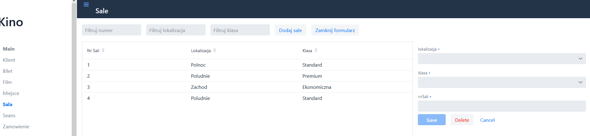
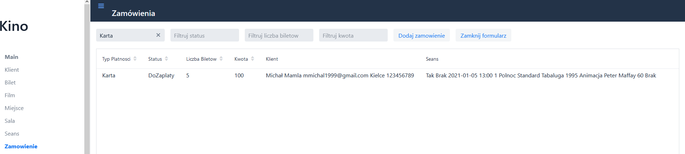
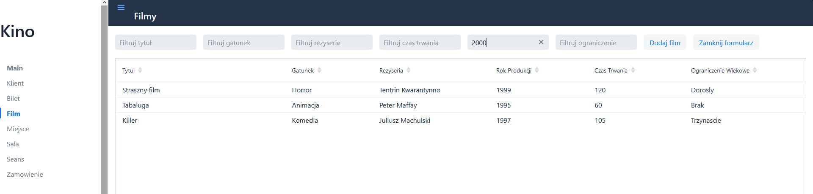
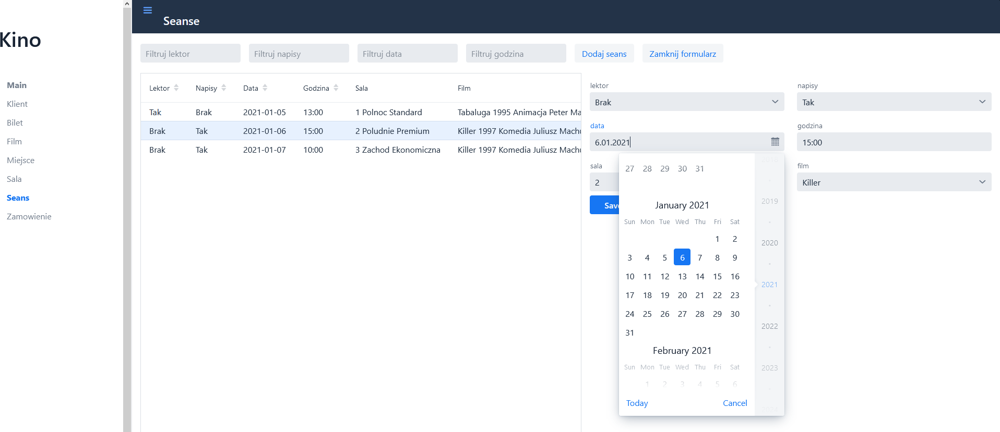

# TO_Mongo_Practice
>Simple local - hosted web application with use of Vaadin and MongoDB.

## Table of contents
* [General](#general)
* [Screenshots](#screenshots)
* [Techstack](#techstack)
* [Features](#features)
* [Setup](#Setup)
* [Status](#Status)
* [Contact](#Contact)

## General
This application contains a basic CRUD functions that operates on object database.
Frontend and web-services are provided by Vaadin framework.

It was created for University lessons (Cracow University of Technology). 

## Screenshots

  
  
  
  
  

## Techstack
* Java 11
* Vaadin
* MongoDB with drivers
* Lombok annotations
* Spring
* Maven

## Features
* View tables in database
* Add new data
* Delete existing data
* Modify existing data
* multi-filter data
* Responsive UI

## Setup
Make connection to your MongoDB

## Status
This project is no longer updated.

## Contact
Feel free to contact if you have any question
* email: mmichal1999@gmail.com
* github: https://github.com/bearyogi/